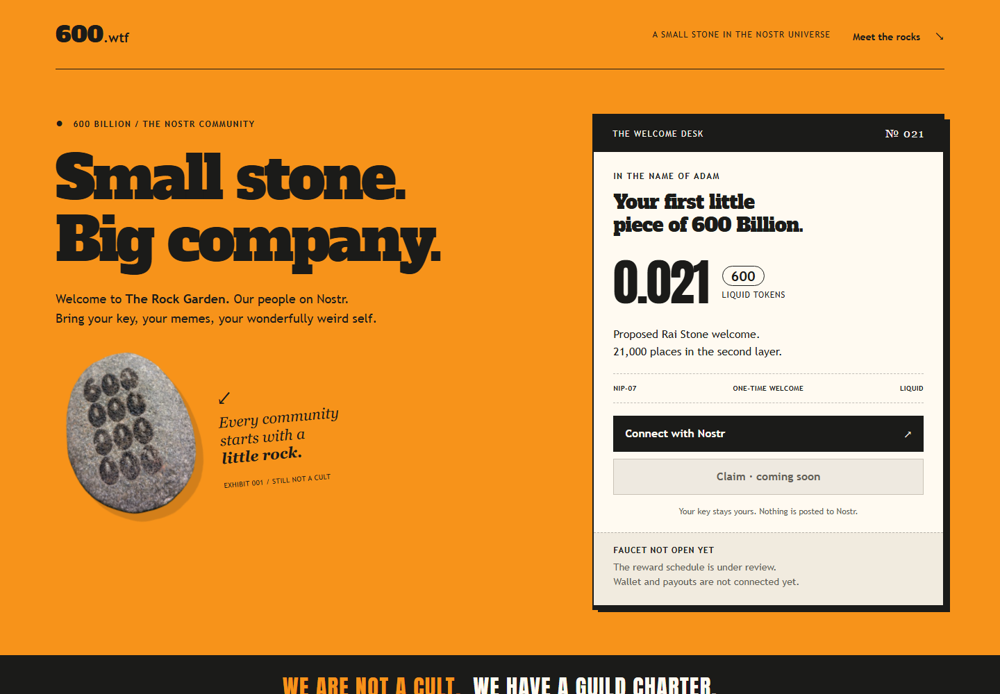
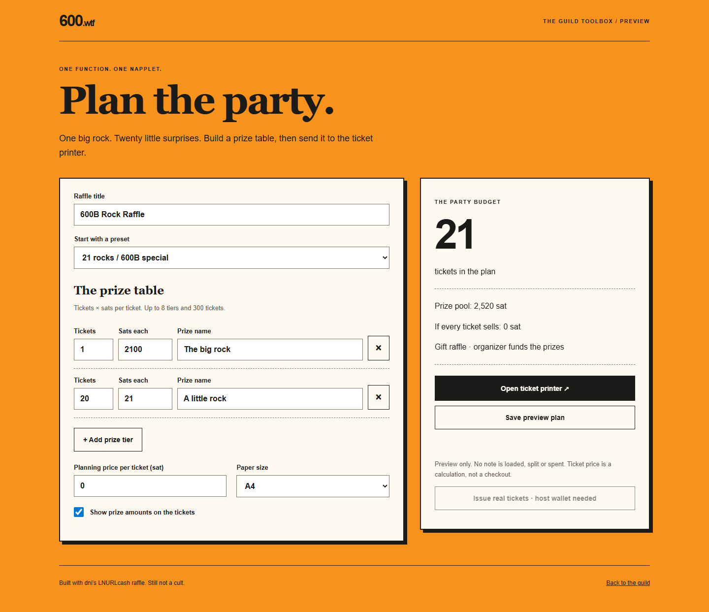
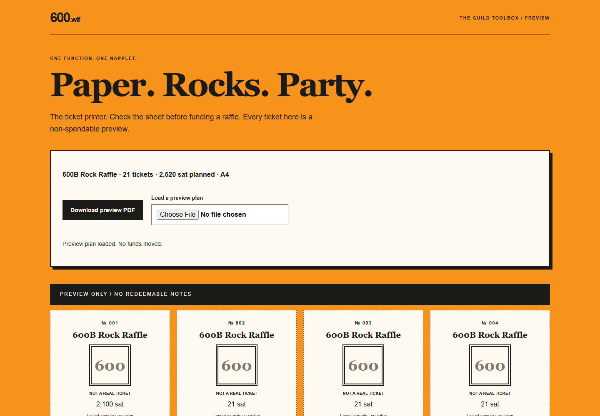
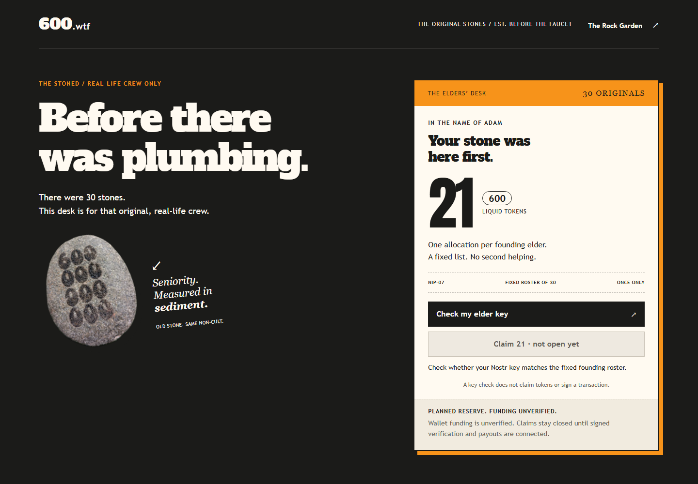
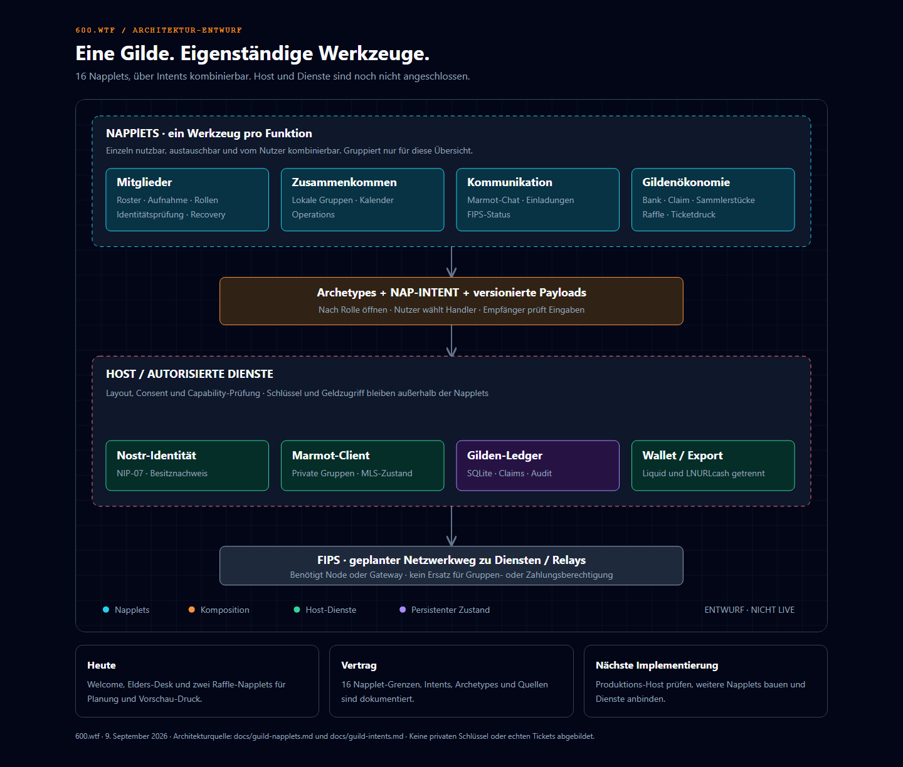
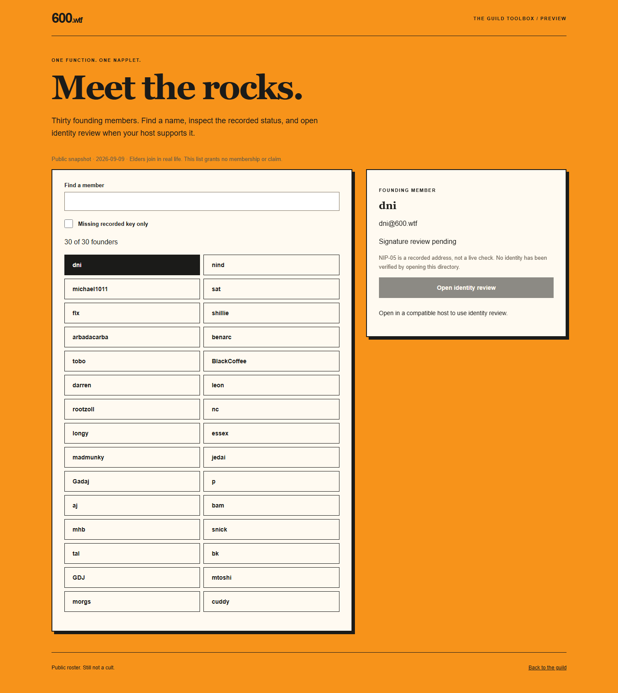

# 600.wtf · Die Gilde mit den Steinen

**Eine Nostr-Community. Eigenständige Napplets. Gemeinsame Projekte. Still not a cult.**

600.wtf entwickelt ein Gildensystem mit Mitgliederverzeichnis, lokalen Treffen,
privaten Gruppen und einer nachvollziehbaren Gemeinschaftskasse. Jede Funktion
wird ein eigenes **Napplet**: ein kleines Werkzeug, das einzeln funktioniert und
sich mit anderen kombinieren lässt. Der Nutzer stellt seine Oberfläche zusammen.

Heute gibt es eine bedienbare Community-Vorschau, einen separaten Elders-Desk und
zwei Raffle-Werkzeuge und einen lokalen Gilden-Workspace mit dreizehn weiteren Napplets.
Ortsgruppen, Termine, Aufgaben, Dienste und kosmetische Auswahl werden in SQLite
gespeichert. Die lokale Marmot-Demo hängt an Hangar; Kasse und FIPS bleiben
unverbunden. Echte Auszahlungen sind geschlossen.



[Funktionsstand](#was-heute-funktioniert) · [Raffle](#raffle-planen-und-lose-vorbereiten) ·
[Mitgliedschaft](#welcher-stein-bist-du) · [Technik](#technischer-teil) ·
[Lokal starten](#lokal-starten) · [Dokumentation](#dokumentation)

## Was heute funktioniert

| Bereich | Stand |
|---|---|
| Rock Garden | Responsive Welcome-Seite; NIP-07 liest einen öffentlichen Schlüssel für die lokale Anzeige |
| Elders-Desk | Eingefrorenes Verzeichnis der 30 Gründer; Schlüsselabgleich; Claims bleiben gesperrt |
| Avatar-Recovery | Nicht angeboten. Das Napplet zeigt den Status als nicht verfügbar; Bearlett-Restore ist nicht angebunden |
| Mitglieder-Napplet | Durchsuchbare Gründerliste, aufgezeichneter Prüfstatus, optionaler Identity-Review-Intent |
| Raffle-Planer | Preisstufen, Presets, Ticketanzahl, Sats-Budget und Export eines Vorschau-Plans |
| Ticket-Printer | Eigenständiges Werkzeug; Plan importieren, Loslayout ansehen, Vorschau-PDF herunterladen |
| Supply-Modell | Reproduzierbare 21-Jahres-Rechnung mit ganzen atomaren Einheiten und Tests |
| Gilden-Komposition | 20 Werkzeuggrenzen, 17 Builds; lokaler SQLite-Workspace; Hangar + Alby oder Keycast-Bunker für echte Identität |
| Marmot / White Noise / FIPS | Gruppen in Hangar; Chat in White Noise; FIPS und Auszahlung unverbunden |

Ein angezeigter Nostr-Schlüssel ist noch keine authentifizierte Mitgliedschaft.
Die aktuellen Seiten veröffentlichen keine Mitgliedschaft und zahlen keine Tokens aus.

### Gilden-Workspace ausprobieren

```sh
node scripts/guild-workspace.mjs
```

Mit Node.js 24 unter **http://127.0.0.1:4175** öffnen. Der Node-Host ist nur für
Tests und Offline (`MARMOT_RELAYS=off` / e2e). Echte Leute loggen sich in Hangar
mit Alby (NIP-07) oder einem Keycast-Bunker (NIP-46) ein — nicht mit
`.guild-marmot-secret`. Der Messenger ist White Noise, nicht dieses Chat-Napplet.
`HANGAR_ROOT`, `MARMOT_RELAYS` und `MARMOT_SECRET` stehen in
[docs/guild-workspace.md](docs/guild-workspace.md). HTTP bleibt Loopback; Relays
sind nur der Marmot-Transport. Ortsgruppen, Termine und Aufgaben laufen
nebeneinander; jedes weitere Werkzeug lässt sich einzeln öffnen.


## Raffle planen und Lose vorbereiten

Die Raffle nutzt die vorhandene Berechnungs- und PDF-Logik von
[dni / LNURLcash Raffle](https://github.com/lnurlcash/raffle). Der unveränderte
Quellstand ist mit Versionsnachweis und Tests im Repository enthalten.

1. **Planen:** Preset wählen, Preisstufen anpassen und das Sats-Budget prüfen.
2. **Übergeben:** Den eigenständigen Ticket-Printer öffnen. Im Host erfolgt das
   über einen Intent; die lokale Browser-Vorschau funktioniert auch ohne Host.
3. **Drucken:** Einen klar als Vorschau markierten PDF-Losbogen herunterladen.





Das Startbeispiel enthält **21 Lose**: eines mit 2.100 sat und zwanzig mit je
21 sat — zusammen **2.520 sat geplante Preise**. Es bewegt kein Geld. Alle
erzeugten PDFs enthalten ausschließlich Platzhalter. Echte LNURLcash-Ausgabe
benötigt den autorisierten Wallet-Dienst; PDF-Export im eingebetteten Host ist
bis zur Export-Anbindung deaktiviert. Ein Ticketpreis ist derzeit nur eine Rechnung.

## Welcher Stein bist du?

Das Ziel sind **600.000 verschiedene Mitglieder**. Es ist ein Ziel, keine
Behauptung über heutige Mitgliederzahlen.

| Ebene | Plätze | Bedeutung |
|---|---:|---|
| The Stoned / Elders | 600 | Persönlich getroffen und aufgenommen; 30 Gründungsplätze sind festgehalten |
| Rai Stones | 21.000 | Zweite Ebene der Community |
| Weitere Steine | 578.400 | Vorgeschlagene Kohorten: Obsidian, Basalt, Granite, Pumice und Pocket Pebbles |

**Elders sind IRL-only.** Ein bezahlter Titel macht niemanden zum Elder oder
Officer. Geplante Sammlerstücke und kosmetische Ränge kaufen weder Fortschritt
noch einen zweiten Welcome-Claim. Gruppenrechte werden separat geprüft.



### Die Token-Zahlen richtig lesen

Das Liquid-Asset hat **600.000.000.000 atomare Einheiten bei acht Dezimalstellen**:
Das sind **6.000 ganze `600`-Tokens**. 21 ganze Tokens für jedes der 600.000
Mitglieder wären damit nicht finanzierbar.

Die bestätigte Elder-Zuteilung beträgt **1.827 ganze Tokens**:
30 × 21 für die Gründer und 570 × 2,1 für künftige Elders. Diese Planung ist noch
kein Nachweis einer finanzierten oder gesperrten Wallet. Online-Rewards, spätere
Verkäufe und Burns bleiben Vorschläge. Transfers verkleinern den Bestand der
Gildenkasse; nur tatsächliche Burns reduzieren die ausstehende Token-Menge.

[Rechnung, Annahmen und Quellen im 21-Jahres-Plan](docs/600-21-year-plan.md).
LNURLcash-Raffle-Sats und die Liquid-Reserve werden getrennt behandelt.

## Technischer Teil

### Architektur



[Eigenständige HTML-Grafik](docs/guild-architecture.html) ·
[Architekturentscheidung](docs/guild-system.md)

- **Napplets:** eine Funktion pro Bundle; voneinander unabhängig, ohne gemeinsamen
  DOM- oder Speicherzugriff. Mitgliederverzeichnis, Raffle-Planer und Printer liegen als einzelne HTML-Builds vor.
- **Archetypes und NAP-INTENT:** der Aufrufer nennt Rolle und Vertrag. Der Host
  wählt den Handler; empfangene Daten werden validiert. Gildenspezifische Rollen
  sind Vorschläge und werden nicht als anerkannte Standards ausgegeben.
- **Nostr / NIP-07:** Identität und explizites Signieren im Host. Ein Sandbox-Napplet
  erhält keine privaten Schlüssel und keinen direkten Wallet-Zugriff.
- **Marmot:** ausgewähltes Protokoll für private Gruppen. Der Host verwaltet MLS-Zustand.
- **FIPS:** geplanter Mesh-Netzwerkweg; benötigt einen Node oder ein Gateway.
- **Ledger und Adapter:** geplantes SQLite-Audit für Mitgliedschaften, Claims und
  Recovery; Liquid und LNURLcash erhalten getrennte Abrechnungs- und Ausführungswege.

Die zwei Raffle-Napplets pinnen SDK **0.28.0**, core/nap **0.32.0** und Manifest-Plugin
**0.14.1**. Sie verwenden `convention/conventions`. Das ältere SDK im separaten
Palace-Projekt verwendet noch `protocol/protocols`; der Unterschied ist
[dokumentiert](docs/guild-intents.md). Browser-Tests verwenden Host-Domain-Fixtures,
keinen vollständigen installierten Produktions-Host.

### Napplet metadata

Every build in `napplets/dist/` is one self-contained HTML file. Its head carries
`<meta name="napplet-type">` (the manifest `d` tag) and `<meta name="napplet-requires">`
(the NAP domains the code uses). Both come from `napplets/vite.config.ts`, which writes
the same list as `requires` tags into `.nip5a-manifest.json`, for the Vite builds and for
`build-workspace.mjs` alike:

| Builds | `napplet-requires` |
|---|---|
| raffle, member-directory | `inc,intent` |
| ticket-printer, key-recovery | `inc` |
| chapters, calendar, tasks, roles, treasury, cosmetics, fips, group-* | `inc` |

The workspace and group-* tools also use `window.napplet.guild`. That is a custom host
channel of the guild workspace and the Hangar, not a NAP domain, so it is not in the
meta; its contract is in [docs/guild-workspace.md](docs/guild-workspace.md#host-boundary).
`npm --prefix napplets run test:conformance` runs `@napplet/conformance-cli` against
every build (its Chromium once: `cd napplets && npx playwright install chromium`).

### Lokale Einrichtung

Voraussetzungen: **Node.js 24**, npm, **Python 3.12+** und **uv**.
Aus dem Repository-Stamm:

```sh
npm ci
npm --prefix napplets ci --ignore-scripts
npm --prefix napplets run build
npx playwright install chromium
```

### Lokal starten

```sh
uv run --no-project python -m http.server 4173 --bind 127.0.0.1
```

| Werkzeug | Lokale Adresse |
|---|---|
| Rock Garden | <http://127.0.0.1:4173/pebbles.html> |
| Elders-Desk | <http://127.0.0.1:4173/elders.html> |
| Mitgliederverzeichnis | <http://127.0.0.1:4173/napplets/dist/member-directory/index.html> |
| Raffle-Planer | <http://127.0.0.1:4173/napplets/dist/raffle/index.html> |
| Ticket-Printer | <http://127.0.0.1:4173/napplets/dist/ticket-printer/index.html> |

Die gebauten Raffle-HTMLs und Manifest-Metadaten sind eingecheckt, damit die
bestehende statische Website sie direkt ausliefern kann. Nach Quelländerungen
beide Builds erneuern. Die lokalen Manifest-Dateien sind keine veröffentlichte,
signierte Installation. Dieser PR richtet keinen Produktionsdienst ein.

### Prüfen und reproduzieren

```sh
npm run test:unit
npm --prefix napplets test
npm --prefix napplets run typecheck
npm --prefix napplets run test:host
npm --prefix napplets run test:conformance
npm run test:e2e:guild
npx playwright test tests/pebbles.spec.ts tests/elders.spec.ts tests/raffle.spec.ts
node scripts/supply-plan.mjs
node scripts/capture-readme.mjs
node scripts/capture-guild-workspace.mjs
```

Der statische Server muss für die bisherigen Browser-Tests und Screenshots laufen.
Die neue Gilden-Suite startet ihren eigenen Demo-Host; bei einem bereits laufenden
Host kann `GUILD_EXTERNAL_HOST=1` gesetzt werden. Das Workspace-Screenshot-Skript
startet einen kurzlebigen Host mit fiktiven Daten. Die Raffle-Suite
umfasst 39 Tests einschließlich der übernommenen Upstream-Tests. Browser-Checks
prüfen Formularvalidierung, mobile Darstellung, PDF-Download, Intent-Übergabe und
geschlossene Auszahlungen. Tests decken keine echte Mint-Ausgabe, Wallet-Custody
oder Produktions-Host-Kompatibilität ab.

Der vollständige Testlauf umfasst außerdem ältere Seiten. Ergebnisse und etwaige
vorhandene Fehler werden im PR getrennt von der Feature-Prüfung ausgewiesen.

### Repository-Struktur

```text
pebbles.* / elders.*     Community-Vorschau und Gründer-Desk
data/                   Roster-Snapshot, Charta und Napplet-Katalog
napplets/src/           Directory-, Raffle- und Printer-Implementierung
napplets/vendor/        Unveränderter, gepinnter Upstream-Quellstand
napplets/dist/          Vier gebaute HTML-Napplets mit Manifest-Metadaten
scripts/                Supply-Rechnung und reproduzierbare Screenshots
tests/                  Browser-, Katalog- und Modelltests
docs/                   Entscheidungen, Verträge, Quellen und Abbildungen
```

## Dokumentation

| Dokument | Inhalt |
|---|---|
| [Gildensystem](docs/guild-system.md) | Aufnahme, Rollen, Marmot und FIPS |
| [Composable Napplets](docs/guild-napplets.md) | Die 19 eigenständigen Funktionen |
| [Intents und Archetypes](docs/guild-intents.md) | Payloads, Handlersuche, Fehlerfälle und SDK-Abgleich |
| [Raffle-Integration](docs/raffle-integration.md) | Upstream-Herkunft, Implementierung und verbleibende Anbindungen |
| [21-Jahres-Plan](docs/600-21-year-plan.md) | Token-Einheiten, Reserven, Szenarien und Jahresrechnung |
| [Identität und Recovery](docs/elder-identity-napplet.md) | Schlüsselprüfung und vorgeschlagene Elder-Freigaben |

## Mitwirken und Herkunft

Änderungen bleiben klein und überprüfbar. Funktion, Vertrag und Tests werden
gemeinsam geändert; Originaldaten und vendorte Quellen bleiben unverändert.
Commits folgen Conventional Commits. Vor einer Veröffentlichung sind Review
und die jeweiligen Integrationsprüfungen erforderlich.

Neue Napplet-Quellen tragen MIT-Lizenzhinweise. Die wiederverwendete Raffle-Logik
stammt von **dni / lnurlcash**; Herkunft und Lizenzmetadaten stehen in
[napplets/vendor/README.md](napplets/vendor/README.md); Lizenztexte der Runtime-
Abhängigkeiten in [THIRD_PARTY_NOTICES.md](napplets/THIRD_PARTY_NOTICES.md). Vorhandene Marken- und
Charakterbilder werden durch diese Code-Lizenz nicht pauschal neu lizenziert.

*wir foan a aundas program.*



Details zum [Mitglieder-Napplet und seinen Intent-Grenzen](docs/member-directory.md).

[Gilden-Workspace und Host-Verträge](docs/guild-workspace.md) · [Avatar-Recovery und Bearlett](docs/recovery-implementation.md) · [Web of Trust / Nostrocket](docs/recovery-trust-research.md)

Nächster Meilenstein: **echte Marmot-Gruppe und Chat**; Meetups und weitere
Gildenfunktionen folgen später. [Audit-Übergabe für Grok und Produktionskriterien](docs/grok-marmot-audit-handoff.md).
