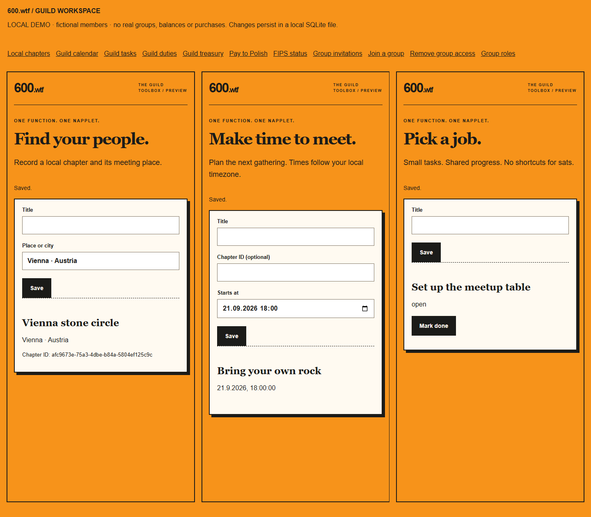

# Guild workspace

Current release priority (10 September 2026): real Marmot groups and chat first.
Meetups and the other guild extras can follow later. See the
[Grok audit handoff and production acceptance criteria](grok-marmot-audit-handoff.md).

Eleven small tools extend the existing directory, recovery and two Raffle builds.
Each builds to its own HTML file and manifest. They share presentation helpers;
they never import another napplet or read a sibling frame's state.

## Try it locally

Use Node.js 24 or newer, with built-in SQLite:

```sh
npm --prefix napplets ci
npm --prefix napplets run build
node scripts/guild-workspace.mjs
```

Open **http://127.0.0.1:4175**. The default layout places chapters, calendar and
tasks side by side. The navigation opens each other tool independently. The
organizer and member are fictional; changes persist in `.guild-demo.sqlite`.
`GUILD_DEMO_DB` selects a different local database and `GUILD_PORT` changes the port.
This loopback server has no production login and must not be reverse-proxied.



## What each tool does

| Build directory | Archetype | Implemented operation |
|---|---|---|
| `chapters` | `chapter-directory` | Create and list local meeting places |
| `calendar` | `calendar` | Create dated events, optionally linked to a chapter |
| `tasks` | `operation-board` | Create tasks and mark them done with revision checking |
| `roles` | `role-manager` | Officers assign/revoke event-organizer and treasurer duties |
| `cosmetics` | `collectible-catalog` | Save one cosmetic preview; purchases unavailable |
| `treasury` | `treasury-view` | Read a dated, authorized asset balance snapshot |
| `fips` | `network-status` | Read dated connectivity and peer count |
| `group-invite` | `group-manager` | Request a Marmot invitation |
| `group-join` | `group-join` | Accept a Marmot invitation for the current member |
| `group-remove` | `group-removal` | Request removal of a Marmot group member |
| `group-roles` | `group-role-manager` | Request a member/moderator role change |

All eleven advertise action `open` with convention `napplet:<archetype>/open-v1`.
Their exact navigation payload is `{version: 1, guildId: "600b"}`. Opening a tool
does not mutate state. Manifests are unsigned local build metadata, not evidence
of installation or full Nappelin conformance. Host services below are a **local
extension contract**, not methods supplied by the Nappelin SDK.

Calendar currently provides an event list, not attendance, recurrence or reminders.
Tasks have open/done states, not assignment or dependencies. Chapters have a text
location, not a map. Guild duties cannot grant officer, elder or guardian status.
Cosmetics confer no authority, entitlement or time advantage.

## Host boundary

The host grants a mounted frame a scoped `window.napplet.guild` object:

```ts
read(): Promise<unknown>
command({requestId, action, input}): Promise<unknown>
group({requestId, groupId, memberId, role}): Promise<{
  state: 'confirmed' | 'uncertain'; receiptId?: string
}>
```

`guildCapability` fixes the tool and allowed actions on the host. A tasks frame
cannot turn itself into a role manager by changing its payload. The trusted host
supplies `{memberId, version}` from an authenticated session, never from the frame.
`GuildStore` compares that version with the current recovery identity on every
operation, including deduplicated retries, and reads current duties from SQLite.

Wire the identity authority with
`new GuildStore(path, trustedDuties, id => recoveryLedger.sessionVersion(id))`.
`sessionVersion` blocks ordinary guild access while that identity's current
recovery still has pending follow-ups; the separate recovery capability stays usable.
Only an authenticated proof of possession of the member's current key may create
a host session. `getPublicKey()` alone is not authentication. Closing old frames,
revoking cookies/tokens and removing any cached private data remain host duties.

Chapters/events/tasks require officer or event-organizer duty. Role changes require
officer. Cosmetic selection is personal. Treasury adapters must apply their own
permitted ledger scope; membership alone does not authorize private bank records.

SQLite transactions record decisions before mutations and deduplicate request IDs.
Reusing an ID with different content is rejected. Task completion requires the
current revision. Cosmetic history is retained. No wallet keys or MLS secrets are
stored here. Keep databases outside static hosting and back them up as private data.

The demo uses `sandbox="allow-scripts"`, an opaque frame origin, matching source
windows, per-frame capabilities, exact loopback Host/Origin checks and a random
host token. Frames have no network capability. It demonstrates composition; its
postMessage bridge is not a production authentication transport.

## Marmot adapter

Pass a trusted `adapters.marmot` object with `protocol: 'marmot'` and:

- `authorize(principal, command)`: resolve the caller-scoped `groupId`, check current
  group permissions, verified membership and the intended target. For join, check
  an actual outstanding invitation/Welcome for the current member.
- `execute(command)`: perform the requested client operation exactly once under
  `requestId`, using the Marmot client's own MLS state machine.
- `status(command)`: reconcile the original request without resending it.

Both operation methods return `{confirmed: true, receiptId}` only after verified
client completion. An HTTP 200, queued request or optimistic UI change is not a
membership receipt. A removal must commit the member's removal and advance the
group epoch. A join must validate and process the intended Welcome. These tools
do not implement MLS or invent a role protocol. The adapter must map duties to
the chosen client's actual supported authorization semantics or reject them.

The current [Marmot specification](https://github.com/marmot-protocol/marmot)
separates protocol core, transports and features; its old MIP-era documents are
deprecated. The inspected Nappelin Hangar has no Marmot client. There is therefore
**no live Marmot adapter in this change**. No public-chat fallback is provided.

`ExternalJournal` records dispatch before network execution. An uncertain result
is queried on retry, never automatically executed again. Unresolved group requests
are restored from SQLite only to the same actor, identity version and action.
If a process dies before dispatch, even that job requires explicit reconciliation
instead of a blind retry. Adapters must enforce bounded timeouts, durable request
IDs and group-wide serialization across different requests. Guard against recovery
or member-role changes while a network operation is in flight.

## Recovery wiring

`nip07RecoverySigner(extension, confirm)` binds the host NIP-07 signer to an explicit
consent screen and checks account changes before/after signing. The recovery ledger
still verifies the exact signed event and Schnorr signature. Neither the extension
nor private keys are exposed to the napplet.

The host can attach the durable follow-up worker to activation:

```js
const signer = nip07RecoverySigner(hostExtensionBridge, showRecoveryConsent);
const synchronize = caseId => synchronizeRecovery(ledger, journal, caseId, adapters);
const recovery = recoveryCapability(ledger, signer, undefined, synchronize);
```

`hostExtensionBridge` is an authenticated host RPC to its browser signer, not an
untrusted caller-supplied object. On restart the host must revisit pending ledger
outbox cases with `synchronize`; the same worker can safely retry after an uncertain
result. `confirmFollowup` is trusted-worker-only and must never be exposed as a
frame/RPC method. A pending follow-up does not roll back the identity mapping.

Follow-ups run in this order:

1. `sessions`: confirm all governed old sessions and refresh tokens are revoked.
   New privileged guild sessions must remain blocked while follow-ups are pending.
2. `marmot`: remove the old key/client from every governed group and confirm fresh
   access for the new identity under the client's protocol. No old MLS secrets are
   copied. Removal prevents future access; it cannot erase previously read messages.
3. `publication`: publish the approved stable-member/current-key mapping with the
   required signatures and relay acknowledgements. Publish only after revocation.

These three adapters implement the same `execute/status` receipt contract. Marmot
also declares `protocol: 'marmot'`. The journal binds each request to case, old/new
public keys and identity version. A newer recovery stops an older worker. Completion
requires all three receipts; missing adapters stay blocked and uncertain operations
stay pending. A client must enforce the identity version when committing effects,
not merely when receiving a request, to fence an in-flight superseded recovery.

Real guardians still need explicit designation from verified elders. Bootstrap
requires verified unique keys, 85% approval of the fixed eligible guardian set and
at least 42 hours of notice/quorum delay. No activity score silently creates a
guardian. A guardian rotation requires authorized policy renewal, which remains
outside this workspace. The wallet retains its independent restoration process;
guild recovery never rewrites a Bearlett seed or vault.

## Read-only external snapshots

Configure `adapters.treasury.read(principal)` to return
`{asOf: ISO_DATE, assets: [{label, balanceAtoms: DECIMAL_STRING, precision: INTEGER}]}`.
Amounts are formatted without floating-point arithmetic. Planned reserves are not
wallet balances. The adapter checks ledger scope and excludes spend authority.

Configure `adapters.fips.read(principal)` to return
`{asOf: ISO_DATE, state: 'connected'|'disconnected'|'unknown', peers: INTEGER}`.
Use an actual authorized [FIPS](https://github.com/jmcorgan/fips) node source; an
ordinary web ping is not proof of mesh membership. The napplet cannot change routes.
Both views clear the previous snapshot before refresh, validate the returned data
and show its timestamp. Neither adapter is configured in the demo.

## Production work still required

Named guardians and reviewed keys; authenticated host sessions and consent UI;
an installed Marmot client and governed group inventory; session-revocation and
identity-publication adapters; authorized treasury/FIPS sources; operational worker
startup/retry handling and installed-host conformance tests. Cosmetic checkout,
membership admission, live chat, identity review and real claims remain separate
work. No payout or purchase path is enabled by this change.

## Verification

```sh
npm --prefix napplets run typecheck
npm --prefix napplets run test:host
npm --prefix napplets test
npm run test:unit
npm run test:e2e:guild
node scripts/capture-guild-workspace.mjs
```

The workspace browser suite starts a fictional in-memory host. If running the
local demo already, set `GUILD_EXTERNAL_HOST=1` to use it instead. Host tests cover
role revocation, stale sessions, transactional deduplication, restart recovery,
concurrent external requests, partial recovery and signer changes. The browser
suite checks persistence, sibling unmount, all eleven mobile layouts, scoped tools
and unavailable adapters. It does not prove live Marmot conformance.
