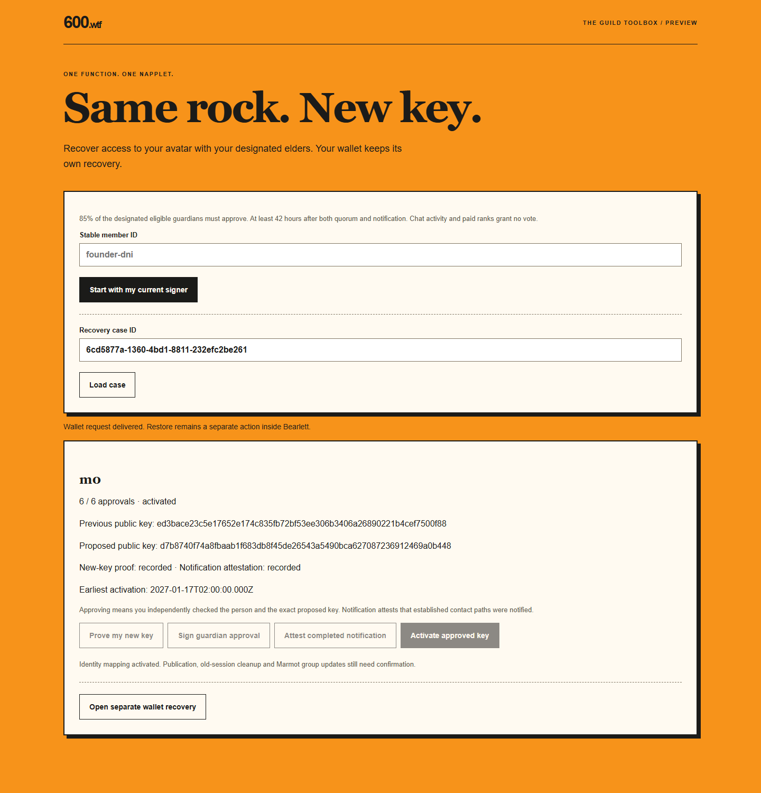
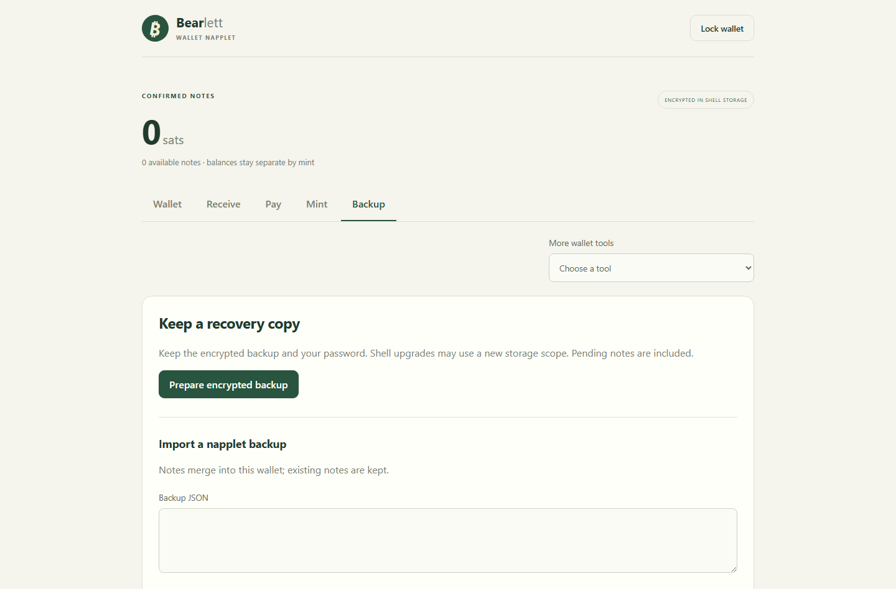

# Avatar recovery and separate Bearlett restoration

Implemented locally, not deployed. This supersedes the earlier 3-of-5 proposal in
[elder identity design](elder-identity-napplet.md) for the new implementation.
Actual production guardians have not been designated or approved.

## Components

| Component | Responsibility |
|---|---|
| `napplets/host/recovery.mjs` | SQLite identity ledger, NIP-01 Schnorr proof verification, immutable case/policy binding, activation and pending follow-ups |
| `napplets/host/recovery-capability.mjs` | Host-side signer/account binding and scoped access |
| `napplets/dist/key-recovery/index.html` | One recovery UI, no direct signer, relay or wallet access |
| Bearlett `napplet:wallet/recovery-v1` | Separate, user-reviewed navigation to existing wallet backup/restore |

Requires Node.js 24 and `npm --prefix napplets ci --ignore-scripts`.
Run `npm --prefix napplets run test:recovery`, `npm --prefix napplets run typecheck`,
`npm --prefix napplets test`, `npm --prefix napplets run build` and
`npx playwright test tests/recovery.spec.ts`.

## Recovery state and proofs

The embedding host initializes a new `RecoveryLedger(dbPath, bootstrap)` with an
explicit trusted roster (unique verified member IDs and keys, consumed-claim state),
designated guardian member IDs, guild/domain, approvalPercent 85, delaySeconds at
least 151200, and expiresSeconds between delay and 30 days. The first bootstrap is
durable; reopening never replaces the policy. No production roster is auto-imported.

1. `prepare(memberId, newKey)` records an inert case. It cannot freeze access. Case
   includes a random ID, stable member, old/new keys, previous identity version,
   domain, policy digest and lifetime. Registered and retired keys cannot be reused.
2. `possession` requires a new-key signature over that exact case.
3. Designated guardians submit case-bound `approve` signatures. One vote per member;
   the target is excluded. The required count is `ceil(eligible guardians * .85)`.
4. A designated guardian signs `notice` only after contacting the established
   channels. This is a notification attestation, not automated proof of delivery.
5. Activation checks quorum, expiry, unchanged guardian keys, previous identity
   version and the delay after the later of quorum/notice. SQLite `BEGIN IMMEDIATE`
   serializes writes; identity change, audit and outbox are committed together.

Events use the NIP-01 serialization/signature format (kind 1 with an explicit
600b-avatar-recovery-v1 tag and purpose). They are application-local proofs, not a
new standardized NIP or treasury multisig. Do not automatically publish them as
social posts. The signer must show purpose, target member and old/new keys before
consent. Approval attests an independent identity check, not merely key possession.

Membership and consumed claims remain attached to the stable ID. Identity version
increments once; competing or stale cases cannot apply. Repeated activation is
idempotent. Changed guardian keys block cases until an authorized policy renewal;
renewal, vote withdrawal and dispute adjudication are not implemented here.

## Host contract

Proposed host extension `guildRecovery` supplies `prepare({memberId})`,
`read({caseId})`, `attest({caseId,purpose})`, and `activate({caseId})` as promises.
The adapter binds a trusted signer with getPublicKey/signEvent; account changes
invalidate in-flight signatures. Reads are scoped to the target's current/proposed
key or a currently authorized guardian. This is not an upstream SDK capability.
Install it through a host's authenticated capability bridge; do not expose the
library directly as a public unauthenticated API or permit a caller to supply its
own signer, bootstrap, clock or authorization policy.

Host deployment must enforce permissions, explicit signing consent, rate limits,
case/data size limits, secure durable storage and protected backups. The library
ships no HTTP listener, API credentials, administrator override or live deployment.
The single state document is suitable for initial integration tests/small deployments;
it is not a demonstrated 600,000-member storage architecture.

Incoming UI role is `key-recovery`, convention `napplet:key-recovery/open-v1`,
action `open`, payload `{version:1,guildId:"600b",caseId}`. Invalid/foreign navigation
is rejected. Missing host leaves all identity-changing controls disabled. Context
does not constitute proof or permission.

After activated mapping, outgoing role `wallet`, action `open`, convention
`napplet:wallet/recovery-v1` carries only `{version:1,guildId,memberId,caseId}`.
All IDs are ASCII letters/digits/underscore/hyphen, 1–128 characters. No keys,
approval flags, evidence, seed, backup, invoice or bearer token cross this intent.
Bearlett treats it as unverified navigation, requires its normal unlock and review,
and opens its existing Backup tab. It never resets/rekeys/restores a vault in response.
Delivery success only means the request was delivered.

## Publication and revocation limits

The outbox records pending identity publication, old-session cleanup and Marmot
access renewal. These adapters are not connected and their work is not marked done.
Host authorization must check the current identity version on every protected action
immediately; merely clearing a browser session later is insufficient. Old Nostr keys
still work on unrelated services. Marmot needs explicit client removal/admission;
old message history is not automatically decrypted. FIPS keys remain independent.

Only current identity/profile references need new publication; old signed events
remain history. A wallet seed/password/accessible backup is still required. Old-key
encrypted backups cannot be decrypted through the guild vote. No bearer funds move.

## Validation and remaining integration

Tests use real Schnorr proofs, SQLite restart, replay/expiry/competing-case failures,
guardian changes and signer switching. Browser fixtures check UI boundaries. Bearlett
has receiver tests and desktop/mobile tests proving locked-state handling, confirmation,
unchanged encrypted storage and no network payment operation. A production Nappelin
bridge, actual signer consent flow and real relay/Marmot publication remain to connect
and verify before enabling recovery for members.

See [Web of Trust and Nostrocket findings](recovery-trust-research.md).

Cross-repository check (build Bearlett's napplet first):

```sh
node scripts/test-recovery-integration.mjs /path/to/bearlett
```

This local fixture uses real signatures and the SQLite/capability implementation,
then mounts both actual UI bundles. Activating the case opens Bearlett's review and
Backup tab; encrypted wallet storage remains byte-for-byte unchanged and no resource
payment request occurs. Disposable fixture keys and a simulated clock are used.
It is an integration test, not production signer/transport conformance.




